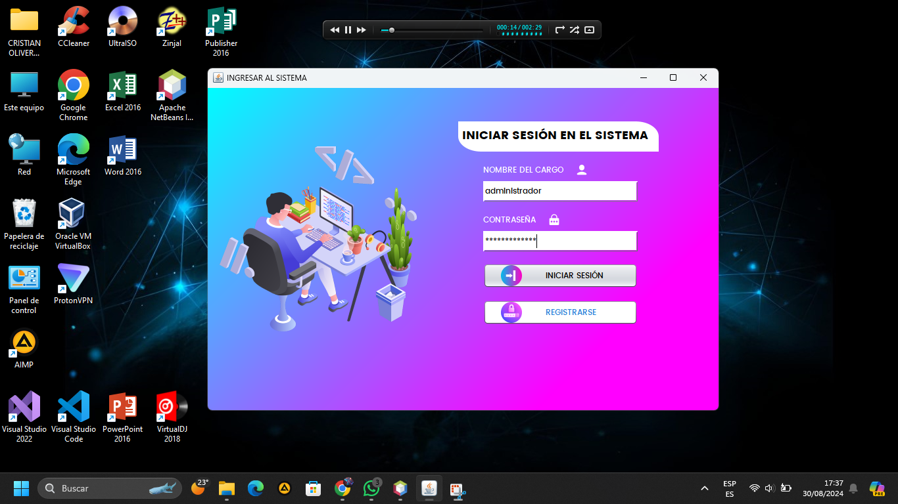
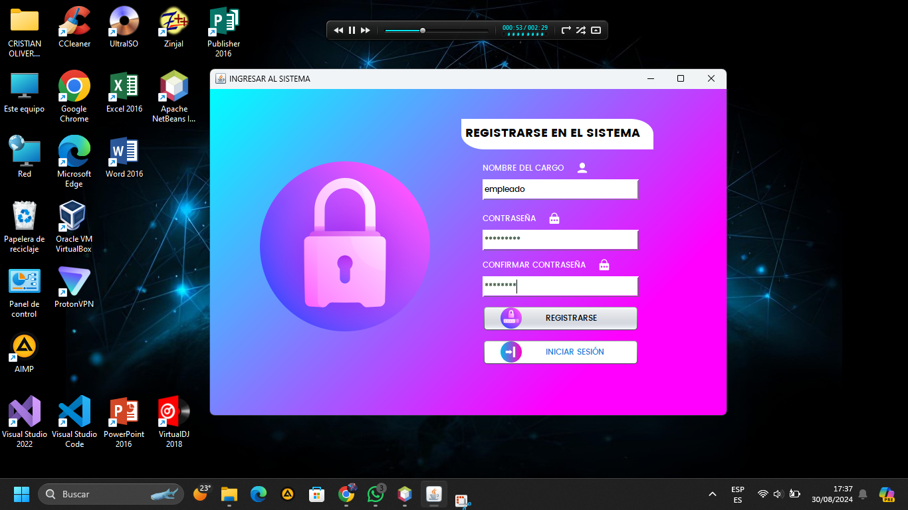
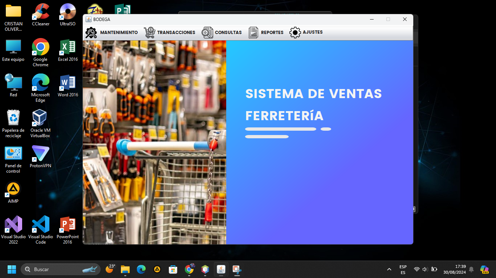
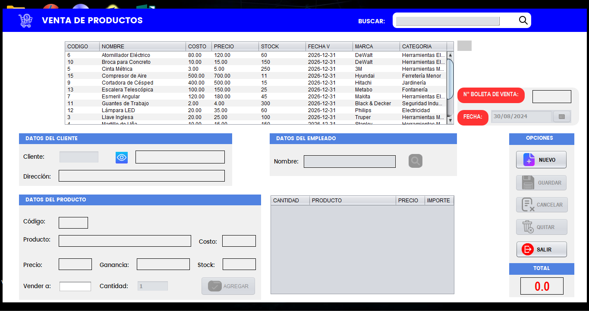

# 🔧 Sistema de Gestión de Inventario y Ventas para una Ferretería

## 📝 Descripción
Este proyecto es un **software de escritorio** diseñado para optimizar la 
**gestión de inventarios y ventas** en una ferretería. Permite a los usuarios administrar de
manera eficiente **productos, clientes, empleados, categorías, marcas**, y realizar ventas.
También incluye funcionalidades para realizar consultas de **ventas del día**, **vencimiento de productos**, **gestión de empleados**, **clientes** y **cálculo de ganancias**.

## 🖼️ Interfaces

### 🔐 Login
Pantalla de autenticación donde los usuarios ingresan sus credenciales para acceder al sistema.  


### 📝 Registrarse
Pantalla donde los usuarios pueden crear sus cuentas para acceder al sistema.  


### 🏠 Menú Principal
Vista inicial del sistema después de iniciar sesión, que proporciona acceso a todas las funciones principales del software.  


### 💵 Ventas
Interfaz para procesar las ventas, incluyendo la revisión y finalización de la transacción.  


## 🛠️ Tecnologías Utilizadas

- **Lenguaje de Programación**: Java.
- **Base de Datos**: SQLServer.
- **Framework**: Swing.
- **Entorno de Desarrollo**: Apache NetBeans IDE 18.

## 📋 Características

- **Gestión de Inventarios**: Administración de productos, categorías, marcas y niveles de stock.
- **Gestión de Ventas**: Procesamiento de ventas, generación de recibos y manejo de transacciones.
- **Gestión de Clientes y Empleados**: Registro y seguimiento de clientes y empleados.
- **Reportes y Consultas**: Generación de reportes diarios y consultas de inventario, ventas y vencimientos.
- **Seguridad**: Autenticación de usuarios para acceso seguro al sistema.

## 🚀 Instalación

1. Clona el repositorio:
   ```bash
   git clone https://github.com/CristianOlivera1/Ferreteria_SQLServer_Java.git
   ```
2. Ejecute el Script de la base de datos (bdferreteria.txt):
   Ejecutelo en SQLServer
2. Añada las dependencias al proyecto
   Las librearias entan en la caroeta librerias rede ahi podra añadir los jar necesarios para que el proyecto se ejecute de forma correcta
